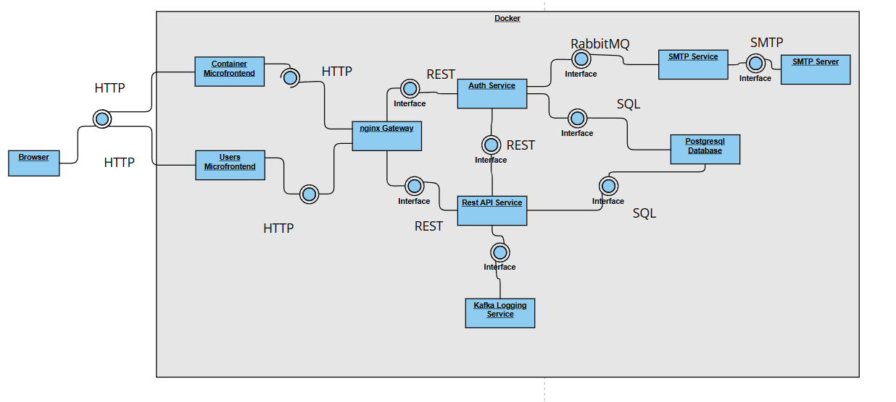
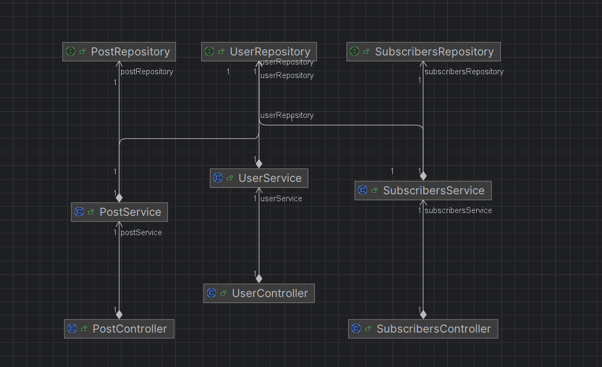
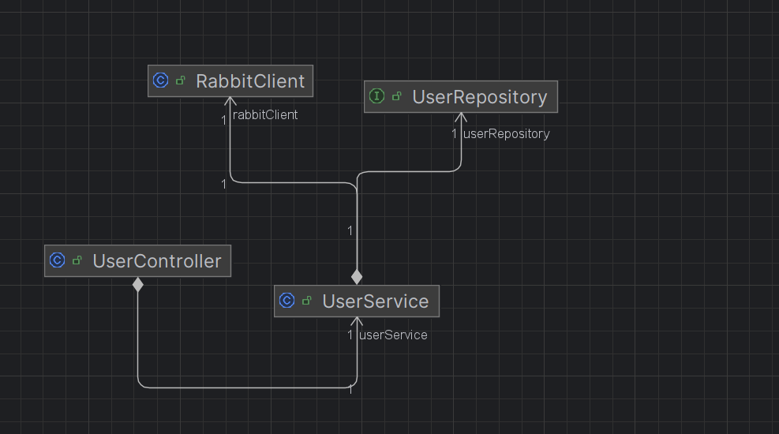

# SOAProject: Java & React Blog Website

This project is a simple blog website built using Java (Spring Boot) for the backend and React for the frontend. The platform allows users to create, edit, and delete blog posts, as well as read posts published by others.

## Setup

Docker and Java 17 is needed to run the project.

Package the 4 Java microservices using `mvn package` - `restAPI`, `authService`, `smtpService` and `kafkaService`.

Run `docker-compose up -d` at the root of the project. The front-end for the application will be available at `localhost:3000`

## Project overview

This project is a simple blog website built using Java (Spring Boot) for the backend and React for the frontend. It provides user authentication with JWT, allowing users to register, log in, and manage their profiles. Users can create, edit, delete, and read blog posts, with a commenting system for engagement. The frontend is built with React and Material UI for a modern, responsive UI, while the backend uses Spring Boot with a RESTful API and a PostgreSQL/MySQL database for data management.

## Features

* Environment configurations are provided by Docker or populated from the docker-compose file.
* A shared PostgreSQL database instance stores all application data.
* Multiple instances of the Java REST APIs run concurrently, with Nginx Gateway handling load balancing and external access.
* RabbitMQ ensures that registration emails are sent asynchronously.
* To maintain traceability across multiple instances, logs are centralized in the loggingService.
* All microservices are stateless for scalability and reliability.
* REST microservices are secured using OAuth, with JWTs generated and managed by the authenticationService.

### RestAPI Microservice

Microservice managing the User, Post, and Subscribers data. It interfaces CRUD operations for the data.

The microservice is protected using Spring Security and communicates with the AuthService using Java Web Tokens (JWT).

It contains a websocket, whenever a user posts a new post, a notification is sent to all users registered to the relevant WebSocket.

The `LoggingAspect` is a class that uses aspect-oriented programming to generate logs whenever any of the exposed APIs are called. These logs are then sent to the `loggingService` using Kafka to centralize them.

Persistence is maintained by the `Repository` in the Repository Layer of the application which communicates with the PostgreSQL database.

### Auth Microservice

Microservice responsible with authentication and user management:
* Represents an OAuth Authentication Server, providing APIs for User Authentication which serve out JWTs.
* Responsible for User Registration, which generates the new User and sends a message to send a registration email.

The public keys are provided to resource servers using the `jwks` API in order to enable them to verify the JWT tokens.

### SMTP Microservice

The SMTP microservice is responsible for handling email delivery. It operates as a RabbitMQ listener, enabling communication with other microservices.

* `RegistrationEmailListener` listens to the EmailQueue in RabbitMQ to process email-related messages.
* `EmailSender` connects to the configured SMTP server to send outgoing emails.

### Logging Service

The Logging Service centralizes logs across multiple microservices. It functions as a Kafka Consumer, ensuring traceability in a distributed environment.

`LoggingListener` subscribes to the log-message topic in Kafka, collecting logs from multiple application instances into a single repository.

### Microfrontends
The UI is built using a microfrontend architecture, consisting of two main components:

`Container Microfrontend`: Acts as the main shell of the application, serving as the landing page and handling authentication and registration.

`Users Microfrontend`: Provides user-related functionalities, such as managing the user list and individual user pages.

### nginx
Nginx serves as the entry point to backend microservices and acts as a load balancer for multiple app instances.

Traffic Routing Rules
* `**/app/**` : Routes requests to the REST API microservices.
* `**/authentication/**`: Directs authentication-related requests to the Authentication Server.
Additionally, Nginx:

Automatically handles CORS preflight (OPTIONS) requests.

Assists WebSocket connections by adding necessary upgrade headers.

Forwards requests without modification unless necessary.

